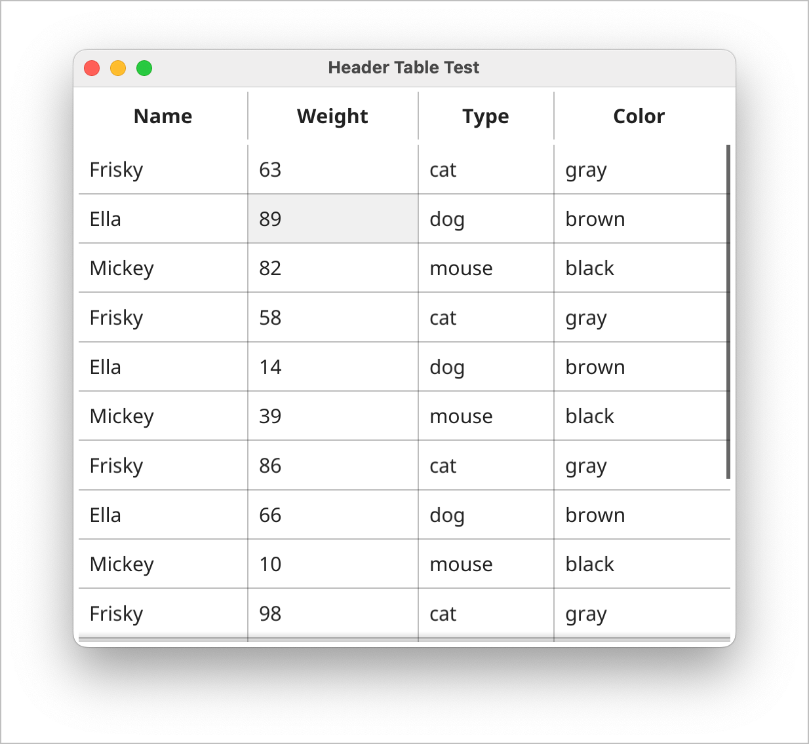
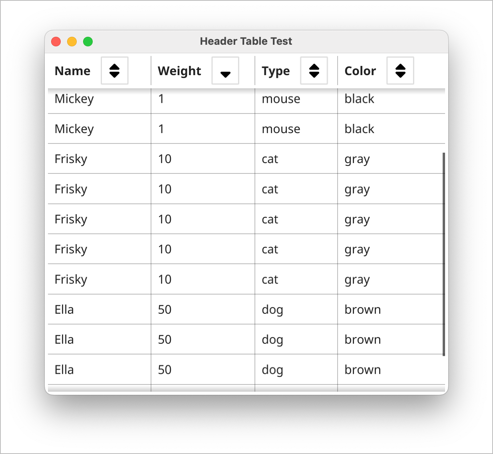

# fyne-headertable

Table with header row for Fyne UI library

## About

**fyne-headertable** is a set of custom widgets for the [Fyne](https://fyne.io/)
toolkit that enhances Fyne's existing [Table widget](https://developer.fyne.io/widget/table) by adding
headers for the columns.

## Widgets

### HeaderTable

A simple yet configurable header for data

### SortingHeaderTable

A header that allows your users to sort the data in your table

### Demos

To see the simple header in action, run
`go run headertable/cmd/plainheader/main.go`

This will create a table with static headers.
This demo illustrates how changes to the underlying data store are reflected in the table
by periodically changing values in the binding store.

The sorting header table is shown by running
`go run headertable/cmd/sortheader/main.go`

This illustrates sortable headers where selecting the sort icon sorts the underlying data.

## Implementing

Take a look at the samples for details, but the basic procedure is

1. Create a `struct` that defines the data in the table
1. Create an array of the type and populate it with data
1. Create an array of fyne Bindings using `binding.BindStruct` for each data element
1. Create a `headertable.TableOpts` instance to hold
    * `ColAttrs` array that describes layout of the column header's text including:
        * Alignment
        * Style
        * Wrapping
        * Width
    * `RefWidth` string that is the basis for sizing the columns
    * `Bindings` the bindings created above
1. Create a Header Table using `headertable.NewHeaderTable`
1. Add the Header Table to the layout

## To Do

* [ ] Fix problem where header table and data table become horizontally out of sync

## Acknowledgements

A special thanks to [rohanthewiz (Rohan Allison)](https://github.com/rohanthewiz)
for providing a basis for these widgets in his [rohanthewiz/rtable: RTable is a thin wrapper around fyne table](https://github.com/rohanthewiz/rtable) repo!
